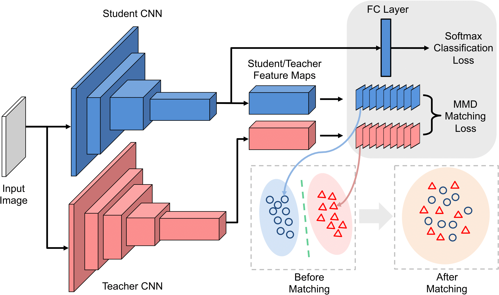

# neuron-selectivity-transfer

This code is a re-implementation of the imagenet classification experiments in the paper [Like What You Like: Knowledge Distill via Neuron Selectivity Transfer
](https://arxiv.org/abs/1707.01219).

<div align="center">
  
</div>

## Citation
If you use our code in your research or wish to refer to the baseline results, please use the following BibTeX entry.
```
@article{NST2017
  author =   {Zehao Huang and Naiyan Wang},
  title =    {Like What You Like: Knowledge Distill via Neuron Selectivity Transfer},
  journal =  {arXiv preprint arXiv:1707.01219},
  year =     {2017}
}
```

## Implementation
This code is implemented by a modified [MXNet](https://github.com/huangzehao/incubator-mxnet-bk) which supports [ResNeXt-like](https://github.com/facebookresearch/ResNeXt) augmentation. (This version of MXNet does not support cudnn7)

## ImageNet data preparation
Download the [ImageNet](http://image-net.org/download-images) dataset and create pass through rec (following [tornadomeet's repository](https://github.com/tornadomeet/ResNet#imagenet) but using unchange mode)

## Run
- ```bash init.sh```
- modify ```config/cfgs.py```
- ```python train.py```

## Results on ImageNet-1k
**Single Model, Single Crop Validation Error:**

| Method            | Model          | Top-1 | Top-5| Download |
| :-------------     |:-------------| :-----:| :-----:| :-----:|
| Student           | Inception-BN | 25.74     | 8.07 | [Dropbox](https://www.dropbox.com/sh/ggwngonbes5lo15/AAA94k7zgO9yCQQtLavHcdtia?dl=0) |
| NST (Poly kernel) | Inception-BN | 24.81      | 7.55 | [Dropbox](https://www.dropbox.com/sh/carpuv04frzc5hx/AAAQxVUuS_WFJEC3RIDdqh7Ma?dl=0) |
| NST (Poly kernel) + KD    | Inception-BN | 24.34      | 7.11 | [Dropbox](https://www.dropbox.com/sh/ekqs25qyp9sjcg3/AABTtywMobR8WSIjuf_OyXs-a?dl=0) |
| NST (Poly kernel) + KD | A modified ResNet-50 | 21.05 | 5.56 | [Dropbox](https://www.dropbox.com/sh/jhnokzbvv8s17ng/AABGgKvzZCgl_U1dU14cmQmka?dl=0) 
> Note:
> The symbol of our modified ResNet-50 (following [SENet](https://arxiv.org/pdf/1709.01507.pdf) Appendix B) is available in [Dropbox](https://www.dropbox.com/sh/jhnokzbvv8s17ng/AABGgKvzZCgl_U1dU14cmQmka?dl=0).
> The mean RGB for our modified ResNet-50 is [123.68, 116.28, 103.53], std is [58.395, 57.12, 57.375]. 
> For Inception-BN, we don't need to do data pre-processing since we add a BN layer in the beginning of the network. 